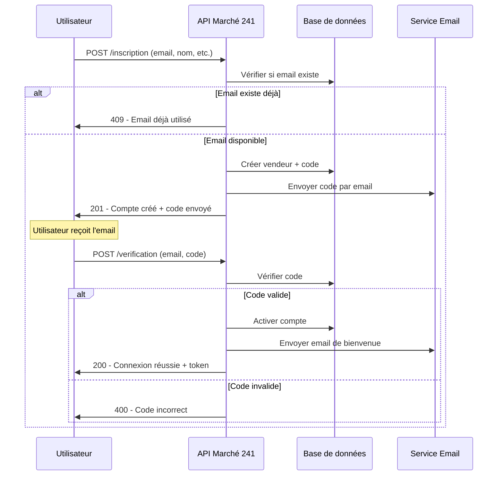

# Guide d'Inscription Vendeur - Marché 241 API

## Vue d'ensemble

L'API Marché 241 propose maintenant un processus d'inscription simplifié en une étape qui crée le compte vendeur et envoie immédiatement le code de vérification par email.

## Nouveau processus d'inscription (Recommandé)

### 1. Inscription complète en une étape

**Endpoint :** `POST /api/v1/vendeurs/inscription`

**Description :** Crée le compte vendeur et envoie immédiatement un code de vérification par email.

**Body :**
```json
{
  "email": "vendeur@example.com",
  "nom": "Jean Dupont",
  "telephone": "+241 01 23 45 67",
  "ville": "Libreville"
}
```

**Réponse (201) :**
```json
{
  "success": true,
  "message": "Compte créé avec succès. Un code de vérification a été envoyé par email.",
  "vendeur": {
    "id": 1,
    "email": "vendeur@example.com",
    "nom": "Jean Dupont",
    "telephone": "+241 01 23 45 67",
    "ville": "Libreville",
    "statut": "en_attente_verification",
    "date_creation": "2024-09-25T17:00:00.000Z"
  },
  "code": "123456"
}
```

**Note :** Le champ `code` n'est présent qu'en mode développement.

### 2. Vérification du code

**Endpoint :** `POST /api/v1/vendeurs/verification`

**Description :** Vérifie le code reçu par email et active le compte.

**Body :**
```json
{
  "email": "vendeur@example.com",
  "code": "123456"
}
```

**Réponse (200) :**
```json
{
  "success": true,
  "message": "Code de vérification valide - Connexion réussie",
  "vendeur": {
    "id": 1,
    "email": "vendeur@example.com",
    "nom": "Jean Dupont",
    "statut": "actif",
    "verification_email": true,
    "derniere_connexion": "2024-09-25T17:05:00.000Z"
  },
  "token": "eyJhbGciOiJIUzI1NiIsInR5cCI6IkpXVCJ9..."
}
```

## Processus complet d'inscription



## Avantages du nouveau processus

### ✅ Simplicité
- **Une seule étape** pour créer le compte et recevoir le code
- **Moins de requêtes** API nécessaires
- **Expérience utilisateur** améliorée

### ✅ Sécurité
- **Vérification immédiate** de l'email
- **Code à 6 chiffres** plus sécurisé
- **Expiration de 30 minutes** pour éviter les problèmes de fuseau horaire

### ✅ Robustesse
- **Gestion des erreurs** d'envoi d'email
- **Logs détaillés** pour le débogage
- **Validation complète** des données

## Gestion des erreurs

### Email déjà utilisé

**Erreur (409) :**
```json
{
  "success": false,
  "message": "Un compte avec cette adresse email existe déjà"
}
```

### Données invalides

**Erreur (400) :**
```json
{
  "success": false,
  "message": "L'adresse email n'est pas valide"
}
```

### Problème d'envoi d'email

**Réponse (201) avec avertissement :**
```json
{
  "success": true,
  "message": "Compte créé avec succès. Veuillez vérifier votre email pour le code de vérification.",
  "vendeur": { ... },
  "code": "123456",
  "warning": "Email non envoyé - Veuillez contacter le support si nécessaire"
}
```

## Exemples avec cURL

### 1. Inscription complète

```bash
curl -X POST http://localhost:3000/api/v1/vendeurs/inscription \
  -H "Content-Type: application/json" \
  -d '{
    "email": "vendeur@example.com",
    "nom": "Jean Dupont",
    "telephone": "+241 01 23 45 67",
    "ville": "Libreville"
  }'
```

### 2. Vérification du code

```bash
curl -X POST http://localhost:3000/api/v1/vendeurs/verification \
  -H "Content-Type: application/json" \
  -d '{
    "email": "vendeur@example.com",
    "code": "123456"
  }'
```

## Exemples avec JavaScript

### 1. Inscription complète

```javascript
const inscription = async (vendeurData) => {
  try {
    const response = await fetch('/api/v1/vendeurs/inscription', {
      method: 'POST',
      headers: {
        'Content-Type': 'application/json'
      },
      body: JSON.stringify(vendeurData)
    });

    const data = await response.json();

    if (data.success) {
      console.log('Compte créé:', data.vendeur);
      console.log('Code (dev):', data.code);
      
      // Rediriger vers la page de vérification
      return { success: true, vendeur: data.vendeur };
    } else {
      throw new Error(data.message);
    }
  } catch (error) {
    console.error('Erreur inscription:', error);
    return { success: false, error: error.message };
  }
};

// Utilisation
const resultat = await inscription({
  email: 'vendeur@example.com',
  nom: 'Jean Dupont',
  telephone: '+241 01 23 45 67',
  ville: 'Libreville'
});
```

### 2. Vérification du code

```javascript
const verifierCode = async (email, code) => {
  try {
    const response = await fetch('/api/v1/vendeurs/verification', {
      method: 'POST',
      headers: {
        'Content-Type': 'application/json'
      },
      body: JSON.stringify({ email, code })
    });

    const data = await response.json();

    if (data.success) {
      // Stocker le token
      localStorage.setItem('token', data.token);
      localStorage.setItem('vendeur', JSON.stringify(data.vendeur));
      
      console.log('Connexion réussie:', data.vendeur);
      return { success: true, vendeur: data.vendeur, token: data.token };
    } else {
      throw new Error(data.message);
    }
  } catch (error) {
    console.error('Erreur vérification:', error);
    return { success: false, error: error.message };
  }
};

// Utilisation
const resultat = await verifierCode('vendeur@example.com', '123456');
```

## Ancien processus (toujours disponible)

Si vous préférez séparer la création du compte et l'envoi du code :

1. `POST /api/v1/vendeurs` - Créer le compte
2. `POST /api/v1/vendeurs/code` - Demander un code
3. `POST /api/v1/vendeurs/verification` - Vérifier le code

## Configuration requise

### Variables d'environnement

```bash
# Gmail SMTP
MAIL_USERNAME=votre-email@gmail.com
MAIL_PASSWORD=votre-mot-de-passe-application
MAIL_FROM_ADDRESS=votre-email@gmail.com
MAIL_FROM_NAME="Marché 241"

# Base de données
SUPABASE_URL=votre-url-supabase
SUPABASE_SERVICE_ROLE_KEY=votre-clé-service
```

### Champs requis

- **email** : Adresse email valide (identifiant unique)
- **nom** : Nom complet du vendeur (2-100 caractères)
- **telephone** : Optionnel, numéro de téléphone
- **ville** : Optionnel, ville du vendeur

## Support

En cas de problème :
1. Vérifiez la configuration Gmail SMTP
2. Consultez les logs du serveur
3. Testez avec la documentation Swagger : `/api/docs`
4. Utilisez les exemples cURL pour déboguer
